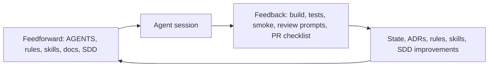

# AI Harness Playbook

> Methodology reference for Doc Organo AI-assisted development.  
> This is a research and planning source, not an always-loaded operational rule.

## Purpose

This playbook captures the working methodology behind the Doc Organo AI Harness: context engineering, Research -> Plan -> Implement, Spec-Driven Design, rules, skills, verification, and MCP adoption.

Use it when designing or improving the harness. During implementation, prefer the focused operational artifacts: `AGENTS.md`, `Documentation/State.md`, rules, skills, SDD files, and review prompts.

## Core Idea

Reliable AI-assisted development depends less on single prompts and more on the system around the model:

- Clear context.
- Durable documentation.
- Small plans.
- Repeatable workflows.
- Verification gates.
- Feedback loops that improve the harness.

This is the shift from prompt engineering to harness engineering.

## LLM Fundamentals

Useful working assumptions:

- LLMs predict likely next tokens from context. They do not inherently know project truth.
- Context window size does not guarantee context quality.
- More context can reduce performance when it introduces stale, conflicting, or irrelevant information.
- Hallucinations, outdated knowledge, prompt sensitivity, context rot, and forgetting are normal failure modes.
- Strong models are best for Research and Plan; faster/cheaper models can work after a strong plan exists.
- Verification must be external to the model whenever possible.

## Context Engineering

Context is the agent's short-term working memory. Good context is selected, ordered, and scoped.

### Context Components

| Component | Role |
|-----------|------|
| System/developer instructions | Global behavior and tool rules |
| `AGENTS.md` | Static project bootstrap |
| `Documentation/State.md` | Current branch/runtime truth |
| Rules | Persistent guardrails |
| Skills | Repeatable task workflows |
| Product docs | Why and prioritization |
| Architecture/technical docs | Durable system context |
| SDD artifacts | Feature-specific Plan handoff |
| Review prompts | Verification sensors |
| MCPs | External/live tool context |

### Loading Policy

Always start large tasks with:

- `Documentation/State.md`
- `AGENTS.md`
- relevant always-on rules

Then load only what the task needs:

- Domain work -> Domain Overview and relevant code.
- SQL work -> migration plan, EF configs, ADRs.
- Front work -> front architecture and Blazor files.
- Harness work -> research, playbook, Harness-Design docs, rules, skills.
- Legacy behavior -> targeted methods, not whole folders.

Avoid carrying full research chats into implementation.

## RPI Workflow

RPI means Research -> Plan -> Implement.

### Research

Goal: understand the system, risks, and options.

Typical activities:

- Explore code and docs.
- Identify current branch/runtime status.
- Compare implementation with domain/product intent.
- Find stale paths, duplicated responsibilities, and missing gates.
- Produce concise durable markdown.

Research output should be a document or design note, not a long chat transcript.

### Plan

Goal: turn research into an executable design.

Typical artifacts:

- Harness design documents.
- SDD `specify.md`, `design.md`, `tasks.md`.
- ADR drafts for durable decisions.
- Review checklists or skill designs when a workflow repeats.

Planning should separate:

- Product intent.
- Architecture decision.
- Current state.
- Feature scope.
- Implementation tasks.

### Implement

Goal: make small, verified changes from the plan.

Implementation should:

- Use focused context.
- Follow rules and skills.
- Avoid unrelated refactors.
- Run appropriate gates.
- Summarize skipped verification.
- Update `Documentation/State.md` when current truth changes.

## Harness Architecture

The harness has two sides:

Feedforward guides the model before generation. Sensors verify results after generation. Durable updates prevent repeating the same mistake.

## Rules, Skills, And Docs

### Rules

Rules are concise guardrails. Use them for:

- Security and PHI.
- Token/context loading.
- Backend, EF, and Blazor conventions.
- Documentation update reminders.

Do not use rules for long workflows or feature plans.

### Skills

Skills are reusable workflows. Use them for:

- Session context.
- Codebase decomposition.
- Harness planning.
- SQL migration slices.
- Legacy rule porting.
- Verification and review routines.

Skills should have a trigger, required context, process, output format, and anti-patterns.

### Auxiliary Documentation

Durable docs own explanation and decisions:

- PRD: stable product WHY.
- PM: current HOW/WHEN.
- RoadMap: future horizons.
- State: NOW.
- ADRs: durable decisions and consequences.
- Architecture docs: system and domain model.
- Technical docs: operational details.
- Research/playbook: methodology and conclusions.

## Spec-Driven Design

SDD is the Plan bridge for feature-sized or risky work.

Use SDD when:

- Work is larger than a small local change.
- Multiple layers are touched.
- Clinical rules or PHI are involved.
- Legacy behavior is ported.
- Schema/API/auth decisions are needed.
- The work may require an ADR.

### SDD Artifacts

1. `specify.md`
   - Context.
   - Problem.
   - Goals.
   - Out of scope.
   - User stories.
   - Acceptance criteria.
   - Ubiquitous language.

2. `design.md`
   - Architecture overview.
   - Components.
   - Reuse analysis.
   - Data/API/front changes.
   - Risks.
   - ADR needs.

3. `tasks.md`
   - Task breakdown.
   - Dependencies.
   - Parallelization.
   - Verification gates.
   - Commit guidance.
   - Post-merge State update.

Do not require full SDD for simple bug fixes or documentation cleanup.

## Verification

Verification is part of the harness, not a final optional step.

### Gate Ladder

1. Structure and file integrity.
2. `dotnet build`.
3. `dotnet test`.
4. SQL integration tests when persistence changes.
5. Swagger or Blazor smoke checks when API/UI behavior changes.
6. Domain review prompt.
7. Security/PHI review prompt.
8. PR checklist.

### Verifier Role

The verifier decides:

- Which gates apply.
- Which gates were run.
- Which gates were skipped and why.
- What residual risk remains.

The verifier may be a human, an agent role, or a future skill, but the responsibility should be explicit.

## Security And PHI

Clinical data is sensitive by default.

Guardrails:

- Do not commit real patient names, CPF, clinical data, credentials, or `.env` values.
- Do not log PHI in `Console.WriteLine`, structured logs, exceptions, prompts, or examples.
- Use synthetic data in tests and docs.
- Make auth assumptions explicit when touching clinical data.
- Keep secrets in environment variables, user secrets, or secure configuration.

Security should be enforced through:

- Always-on rule.
- Security review prompt.
- PR checklist.
- Future verifier workflow.

## MCP Usage

MCPs are useful when the agent needs live or external context.

Adopt now:

- GitHub for issues, PRs, comments, checks, and project coordination.
- Browser for Swagger and Blazor smoke tests.

Defer:

- Custom docs search MCP.
- DB introspection MCP.
- Architecture graph MCP.
- Task management MCP.

Do not build custom MCPs before local documentation, verification, and SQL migration practices are reliable.

## Common Anti-Patterns

| Anti-pattern | Failure mode | Harness response |
|--------------|--------------|------------------|
| One-Shot Hero | Agent tries to solve everything in one prompt | Use RPI and SDD |
| Premature Victory | Agent stops when code looks complete | Use verification gates |
| Session Amnesia | Next session forgets current truth | Keep `State.md` current |
| AI Slop | Code compiles but design degrades | Use review prompts and architecture docs |
| Context Hoarding | Too many files create conflicting context | Use task-specific loading |
| Aspirational Harness | Docs describe workflows that are not used | Validate on real slices |
| Rule Bloat | Always-loaded rules become long essays | Move workflows to skills/docs |
| Skill Sprawl | Skills exist before workflows repeat | Add skills only when useful |

## Doc Organo Application

The methodology should respect Doc Organo constraints:

- Clinical SQL migration is the current anchor.
- `main` remains the Google Sheets reference.
- Legacy code is behavior reference until SQL replacement and characterization tests cover it.
- Financial domain remains deferred.
- Identity/Auth is a supporting capability for MVP2.
- Blazor is Server, not WebAssembly.
- Simplicity improves AI effectiveness: avoid Mediator, CQRS, microservices, and broad abstractions until the need is proven.

## Study Path

Recommended learning sequence:

1. LLM fundamentals and token/context limits.
2. Context engineering and documentation routing.
3. RPI workflow.
4. SDD and feature planning.
5. Rules vs skills.
6. Verification gates and review prompts.
7. MCP usage.
8. Harness feedback loops.

## References

- https://addyosmani.com/blog/agent-harness-engineering/
- https://agent-skills.techleads.club/
- https://github.com/tech-leads-club/agent-skills
- https://github.com/compozy/compozy
- https://github.com/openclaw/openclaw

Recommended books:

- *Software Architecture: The Hard Parts*
- *A Philosophy of Software Design*
- *Fundamentals of Software Architecture*
- *Designing Data-Intensive Applications*
- *Learning Domain-Driven Design*
- *Balancing Coupling in Software Design*

## Relationship To Doc Organo Harness Design

This playbook explains the methodology. The actionable architecture is defined in:

- `Documentation/AI-Harness/Harness-Design/harness-architecture.md`
- `Documentation/AI-Harness/Harness-Design/agents-strategy.md`
- `Documentation/AI-Harness/Harness-Design/rules-strategy.md`
- `Documentation/AI-Harness/Harness-Design/skills-strategy.md`
- `Documentation/AI-Harness/Harness-Design/sdd-operational.md`
