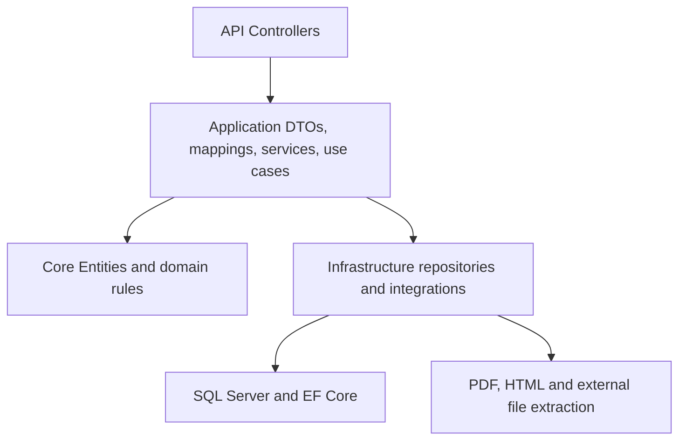

# Architecture Overview — Doc Organo

> Current backend and technical architecture overview.  
> Domain language: [Domain_Overview_Business_Rules.md](Domain_Overview_Business_Rules.md). Decisions: [ADR/](ADR/). Future product horizons: [../Product/RoadMap.md](../Product/RoadMap.md).

## 1. Overview

Doc Organo is a domain-oriented clinic management platform focused on clinical workflow organization and preservation of patient history.

The architecture follows a lightweight Clean Architecture approach:

- Keep business rules in domain entities or thin application use cases.
- Keep repositories focused on persistence.
- Avoid extra abstractions until there is a concrete reason.
- Preserve the existing MVP behavior while migrating persistence from Google Sheets to SQL Server.

## 2. Current Stack

| Layer | Technology |
|-------|------------|
| Backend | ASP.NET Core, .NET 7 |
| Persistence | EF Core 7, SQL Server |
| Frontend | Blazor Server (`DocFront.Web`) |
| Local infra | Docker Compose SQL Server |
| Legacy reference | Google Sheets on `main` / `Legacy/_LegacySheetsDb/` |

## 3. Application Layers

### Domain

Contains the main entities, value objects and business rules.

Includes:

- `Paciente`
- `Prontuario`
- `Agendamento`
- `Atendimento`
- Value objects such as `Endereco` and prontuario details
- Domain rules and invariants
- Repository interfaces

The domain should not depend on infrastructure.

### Application

Coordinates application flows and data transfer.

Includes:

- DTOs.
- AutoMapper profiles.
- Application services.
- Future thin use cases for orchestration-heavy flows.

Use cases should be introduced when rules cross aggregate boundaries or when controller/repository logic would otherwise grow too much.

### Infrastructure

Implements persistence and external integrations.

Includes:

- EF Core `DocDbContext`.
- Fluent API configurations.
- Migrations.
- EF repositories.
- PDF/HTML extraction and generation services.
- Legacy Sheets reference code under `Legacy/_LegacySheetsDb/`.

### API

Exposes HTTP endpoints and request/response boundaries.

Controllers should:

- Validate request shape.
- Call repositories or use cases.
- Return appropriate status codes.
- Avoid business rules and PHI logging.

## 4. Bounded Contexts

| Context | Aggregates | Current guidance |
|---------|------------|------------------|
| Clinical | Paciente, Prontuario, Agendamento, Atendimento | Core MVP and MVP2 focus |
| Support | Checklists, ClinicalEvent, Pendencias | Supports Atendimento and future safety workflows |
| Financial | Demonstrativo, Guias, Itens financeiros | Future; do not expand before clinical SQL migration stabilizes |

Identity/Auth is treated as a supporting capability for MVP2, not a bounded context yet. Revisit only if IAM becomes a product surface.

## 5. Persistence Strategy

The active branch `feature/base_DB` migrates persistence from Google Sheets to SQL Server + EF Core.

Migration order:

1. Paciente.
2. Prontuario.
3. Agendamento.
4. Atendimento.

Rules:

- Legacy Sheets behavior is reference material until SQL replacements and tests cover equivalent behavior.
- Repositories should persist and load data, not contain business rules.
- Atendimento validations should move to domain methods or application use cases.
- Financial tables may exist in schema, but Financial features are deferred.

See [../Technical/migration-sql.md](../Technical/migration-sql.md).

## 6. Clinical Versioning and History

Prontuarios are treated as clinical snapshots. Each relevant clinical change should create a new version instead of overwriting history.

Benefits:

- Complete clinical history.
- Better auditability.
- Safer medical decision support.

Soft delete is used for clinical aggregates to preserve history. See [ADR-001](ADR/ADR-001-soft-delete.md).

## 7. Development Infrastructure

Current local development environment:

- API runs locally.
- SQL Server runs in Docker.
- Frontend runs as Blazor Server.
- Swagger and browser smoke tests are used for manual validation.
- `dotnet test` is the baseline automated verification command.

See [../Technical/runbook.md](../Technical/runbook.md).

## 8. Planned Architecture Work

Near-term MVP2 architecture work:

- Validate Paciente SQL slice against Docker SQL.
- Implement Prontuario, Agendamento and Atendimento EF repositories.
- Add SQL integration tests and characterization tests.
- Add a thin use-case layer only where business orchestration requires it.
- Define minimum Identity/Auth posture for controlled MVP usage.
- Add API contract documentation.

Deferred until justified:

- CQRS.
- Mediator.
- Domain Events.
- Microservices.
- Second DbContext.
