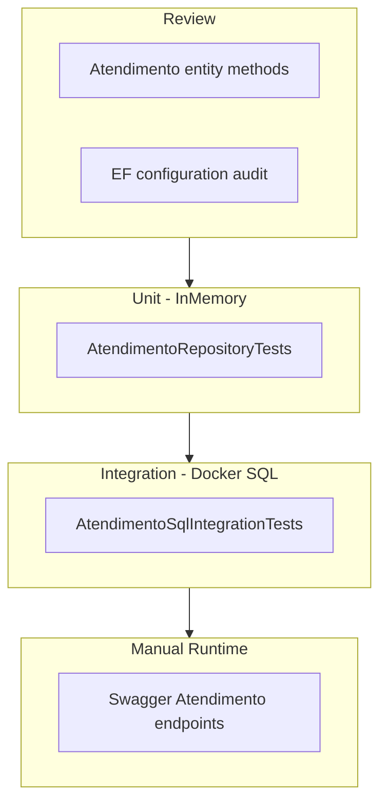

# Design — Atendimento Minimal SQL Stabilization

> Input: `specify.md` in `Documentation/SDD/atendimento-minimal-sql-stabilization/`  
> Generated SDD artifacts are written in English.

## Design Summary

This feature implements SQL persistence for the `Atendimento` aggregate root — the second step in the approved migration sequence — without introducing workflow logic, child entity writes, or frontend changes. The work replaces the stubbed `AtendimentoRepository`, aligns the API to Guid contracts and slim DTOs following the verified Paciente pilot, validates Paciente FK in the Controller/Application layer on create, and adds unit plus **required** SQL integration test coverage.

After implementation, callers can create and retrieve real `Atendimento` rows, obtaining valid `AtendimentoId` values for Prontuario and Agendamento FK constraints. **Repository responsibilities are persistence-only** — no business validation, no workflow logic. Stage progression, pendências, clinical events, and `EtapaAtual` mutation after create are explicitly deferred to `atendimento-workflow-stabilization`.

Execute chooses implementation details (method naming on entity, exception types, mapping strategy) as long as outcomes meet the requirements in `specify.md`.

## Requirement Mapping

| Requirement | Design response |
|-------------|-----------------|
| `REQ-001` | Aggregate constructor/factory owns creation (`PacienteId` required; optional `MensagemParaMedico`); sets `EtapaAtual = Consulta` and `CriadoEm`; Controller invokes factory then repository persists — no blind AutoMapper, no client-owned aggregate state |
| `REQ-002` | `GetByIdAsync(Guid)` against filtered `DbSet`; map to slim `ReadAtendimentoDto` |
| `REQ-003` | `GetByPacienteIdAsync(Guid)` returns non-deleted rows for patient; supports multiple concurrent journeys |
| `REQ-004` | Entity update method for `MensagemParaMedico` only; `UpdateAtendimentoDto` excludes `EtapaAtual`; repository loads existing, applies update, saves |
| `REQ-005` | Entity soft-delete method (Paciente `MarcarComoExcluido` pattern); global query filter excludes deleted rows |
| `REQ-006` | **Controller/Application** validates Paciente exists and is not soft-deleted via `IPacienteRepository` before create; maps failure to HTTP 404; repository does not perform FK validation |
| `REQ-007` | Migrate `IAtendimentoRepository` and controller routes from `string` to `Guid`; slim DTOs use `Guid` for ids |
| `REQ-008` | `AtendimentoSqlIntegrationTests` **required**; passing Docker SQL run is success criterion; skip only for documented operational/environment blockers |
| `REQ-009` | Remove `Console.WriteLine` / `Console.Error.WriteLine` PHI patterns; structured logging without sensitive fields |
| `REQ-010` | Legacy table in `specify.md` reviewed and accepted; no additional code for characterization |

## API Contract

### Contract resolutions (Pre-Execution Review)

| Ambiguity | Resolution |
|-----------|------------|
| POST response | **201 + `ReadAtendimentoDto`** in body with `CreatedAtAction` location (Paciente pattern) |
| ListByPaciente scope | **All non-deleted** atendimentos for `pacienteId`; empty array is 200, not 404 |
| Create payload | Slim `CreateAtendimentoDto`: `PacienteId` required (`Guid`); optional `MensagemParaMedico` — **no** `EtapaAtual`, workflow fields, or denormalized lists; aggregate factory owns all other initial state |
| Update payload | Slim `UpdateAtendimentoDto`: `MensagemParaMedico` only — no `PacienteId`, `EtapaAtual`, workflow DTOs, journey projections, or denormalized lists |
| Read payload | Slim `ReadAtendimentoDto`: `Id`, `PacienteId`, `EtapaAtual` (read-only), `MensagemParaMedico`, `CriadoEm`, `AtualizadoEm` — no `NomePaciente`, `ProntuariosId`, `AgendamentosId`, pendência payloads, or stage status objects |
| EtapaAtual ownership | **Workflow-owned** after create; factory sets Consulta on create only; no create-time stage selection, no update-time stage modification, no stage-advance endpoints in minimal slice |
| Report routes | **Routes remain present**; return **501 Not Implemented** without calling repository; preserves route contract for future workflow/report feature; prevents partial PDF/followUp implementation |

### Endpoints

| Method | Route | Request | Response | Notes |
|--------|-------|---------|----------|-------|
| POST | `/Atendimento` | `CreateAtendimentoDto` | 201 + `ReadAtendimentoDto` | Controller validates PacienteId via `IPacienteRepository` before create; invalid → 404 |
| GET | `/Atendimento/{id}` | — | 200 + `ReadAtendimentoDto` / 404 | Guid route param |
| GET | `/Atendimento` | `skip`, `take` query | 200 + array | Paginated; may be empty |
| GET | `/Atendimento/paciente/{pacienteId}` | — | 200 + array | All non-deleted for patient |
| PUT | `/Atendimento/{id}` | `UpdateAtendimentoDto` | 204 / 404 | Message field only |
| DELETE | `/Atendimento/{id}` | — | 204 / 404 | Soft delete |
| GET | `/Atendimento/report-id/{id}` | — | 501 | Route **preserved**; deferred to workflow/report feature |
| GET | `/Atendimento/followUp-id/{id}` | — | 501 | Route **preserved**; deferred to workflow/report feature |

### Status code parity (Paciente pattern)

| Condition | Code |
|-----------|------|
| Success create | 201 |
| Success read/list | 200 |
| Success update/delete | 204 |
| Missing resource | 404 |
| Invalid pagination / empty body | 400 |
| Invalid Paciente FK on create | 404 |

## Affected Components

| Component | Path | Responsibility | Expected change |
|-----------|------|----------------|-----------------|
| Atendimento aggregate | `DocAPI/Core/Entities/Atendimento.cs` | Journey container identity, soft delete, limited update | Add/update domain methods; do not expose workflow via API |
| Repository interface | `DocAPI/Core/Interfaces/Repositories/IAtendimentoRepository.cs` | Persistence contract | Guid params; add `GetByPacienteIdAsync`; remove report methods |
| Atendimento API | `DocAPI/API/Controllers/AtendimentoController.cs` | HTTP mapping, Paciente FK validation, PHI-safe handling | Guid routes, status codes, Paciente lookup on create, 501 report routes preserved |
| Atendimento repository | `DocAPI/Infrastructure/Repositories/AtendimentoRepository.cs` | SQL CRUD only | Replace stub with `DocDbContext` implementation; no business validation |
| EF configuration | `DocAPI/Infrastructure/SqlDb/Configurations/AtendimentoConfig.cs` | Mapping, indexes, FK | Review only unless gap found |
| DbContext | `DocAPI/Infrastructure/SqlDb/DbContext/DbContext.cs` | Global soft-delete filter | Verify filter exists (already configured) |
| DTOs | `DocAPI/Application/Data/Dtos/Atendimento/` | API contracts | Slim create/read/update DTOs with Guid; no workflow DTOs |
| AutoMapper profile | `DocAPI/Application/Mappings/Profiles/AtendimentoProfile.cs` | Read mapping | Explicit read map only; no blind create/update maps |
| DI registration | `DocAPI/Program.cs` | Repository binding | Verify `AtendimentoRepository` registered |
| Repository unit tests | `DocAPI.Tests/` | InMemory coverage | New `AtendimentoRepositoryTests` |
| SQL integration tests | `DocAPI.Tests/Integration/` | Docker SQL CRUD | New `AtendimentoSqlIntegrationTests` |
| Legacy reference | `DocAPI/Legacy/_LegacySheetsDb/AtendimentoSheetsRepository.cs` | CRUD behavioral evidence | Read-only |

## Reuse Analysis

| Existing code or pattern | Reuse decision | Notes |
|--------------------------|----------------|-------|
| `PacienteRepository` SQL implementation | Reuse pattern | DocDbContext, soft delete, Guid contract, exception mapping |
| `PacienteController` status codes / POST response | Reuse pattern | 201 + read DTO, 404 on missing |
| `PacienteSqlIntegrationTests` fixture | Reuse pattern | Connection string, skip policy, synthetic data |
| `Atendimento(Guid pacienteId)` constructor | Reuse / extend | Already sets Consulta; add soft-delete and update methods |
| ADR-001 global query filter on `Atendimento` | Reuse | Already in `DbDbContext` |
| `AtendimentoConfiguration` | Reuse | Review only |
| Stub `AtendimentoRepository` | Do not reuse | Replace entirely |
| Legacy denormalized DTOs | Do not reuse | Abandon fields per research |
| Blind `CreateMap<CreateAtendimentoDto, Atendimento>()` | Do not reuse | Factory on create |
| `Console.WriteLine` in controller | Do not reuse | PHI violation |
| Report repository methods | Do not reuse | Remove from interface; controller returns 501 without repository call; **routes remain present** |

## Architecture And Ownership

- Architecture impact: None durable — implements planned second aggregate in clinical bounded context within existing repository pattern
- Ownership boundaries:
  - **Aggregate** — constructor/factory owns initial state; limited update and soft-delete methods
  - **Repository** — persistence-only SQL CRUD; no business validation; no workflow logic
  - **Controller/Application** — Paciente FK validation, HTTP mapping, PHI-safe handling, 501 report deferral
  - **Workflow SDD** — `EtapaAtual` mutation after create, stage evaluators, pendência engine, journey projections, workflow DTOs
- Conflicts or constraints: ADR-001 overrides physical delete; workflow SDD owns `ValidacaoEtapa*` and child writes; **repository performs no cross-aggregate reads** — Paciente FK check is Controller/Application responsibility via `IPacienteRepository`

### Repository responsibility (persistence-only)

| Responsibility | Owner | Minimal slice |
|----------------|-------|---------------|
| SQL CRUD (add, query, update, soft-delete persist) | `AtendimentoRepository` | Yes |
| Paciente FK business validation | Controller/Application | Yes — via `IPacienteRepository` lookup before create |
| Workflow logic / stage evaluation | Workflow SDD | No |
| Pendência / ClinicalEvent persistence | Workflow SDD | No |
| Journey projections / workflow DTOs | Workflow SDD | No |

### Aggregate creation ownership

Atendimento creation is owned by the aggregate constructor/factory — not AutoMapper, not the client.

| Create contract field | Required / Optional | Owner |
|-----------------------|---------------------|-------|
| `PacienteId` | Required | Client supplies; Controller validates existence |
| `MensagemParaMedico` | Optional | Client may supply; applied via factory if present |
| `EtapaAtual` | Not in create DTO | Aggregate factory — always `Consulta` |
| `Id`, `CriadoEm`, audit fields | Not in create DTO | Aggregate factory |

### EtapaAtual ownership protection

`EtapaAtual` is **workflow-owned** after initial create.

| Action | Minimal slice |
|--------|---------------|
| Factory sets `Consulta` on create | Allowed |
| Client selects stage on create | **Forbidden** |
| Client modifies stage on update | **Forbidden** |
| API endpoint advances stage | **Forbidden** |
| Read DTO exposes current `EtapaAtual` | Allowed (read-only) |

## Data And Persistence

- Entities: `Atendimento` (root only in this slice)
- DTOs: slim `CreateAtendimentoDto`, `UpdateAtendimentoDto`, `ReadAtendimentoDto`
- EF mappings: `AtendimentoConfiguration` — `EtapaAtual` as `varchar(50)` string conversion; `PacienteId` FK with `Restrict` delete; index on `PacienteId`
- Child tables (`ClinicalEvent`, `AtendimentoPendencia`, `ChecklistExecution`): schema-compatible; **no writes** in this slice
- Migration impact: **None expected** — `InitialCreate` is source of truth
- SQL/runtime checks: Docker `docorgano-sql`, migrated database; `DOCORGANO_TEST_CONNECTION` or `SA_PASSWORD` for tests

### Paciente FK validation (create)

**Controller/Application layer** validates Paciente exists and is not soft-deleted via `IPacienteRepository.GetByIdAsync` before invoking aggregate factory and repository create. Failure maps to HTTP 404. Repository does not perform FK validation and does not read Prontuario or Agendamento.

### Report endpoint strategy

Report routes are **intentionally preserved** with **501 Not Implemented**:

| Route | Behavior | Rationale |
|-------|----------|-----------|
| `GET /Atendimento/report-id/{id}` | 501 — no repository call | Preserves route contract for future workflow/report feature |
| `GET /Atendimento/followUp-id/{id}` | 501 — no repository call | Prevents partial PDF/followUp implementation in minimal slice |

Routes remain in Swagger. Implementation is deferred to a future workflow/report feature — not removed or hidden.

## Frontend Impact

No UI impact is planned or validated by this feature.

- Pages/components: None
- Services/state: None
- UI behavior: None
- Smoke checks: None

API contracts are validated via Swagger and automated tests only.

## Security And PHI Design

- Security-sensitive: **Yes**
- Review prompt expected: **Yes** — `Documentation/AI-Harness/review-prompts/security-phi-review.md`
- Mitigations:
  - Remove `Console.WriteLine` / `Console.Error.WriteLine` from controller
  - Do not log patient names, ids in user-facing error messages beyond generic not-found
  - Synthetic test data only in fixtures
  - Report routes return 501 without invoking repository or legacy PDF paths; routes remain present
  - `AtualizadoPor` remains unset until auth ADR — accepted residual risk

## Legacy Behavior Decision

| Behavior | Source | Preserve / Adapt / Abandon | Design rationale |
|----------|--------|----------------------------|------------------|
| CRUD surface | `AtendimentoSheetsRepository.cs` | Preserve | Repository contract retained at behavioral level |
| Soft delete | SQL + ADR-001 | Preserve | Clinical history preservation |
| Paciente linkage on create | Legacy create | Preserve | FK validation added |
| Update field set | Legacy update | Adapt | Limited to `MensagemParaMedico` |
| List by PacienteId | Implied need | Preserve | Explicit route for multi-journey |
| PDF / followUp reports | Legacy | Adapt | Routes preserved; 501 until workflow/report feature |
| `ValidacaoEtapa*` | Legacy | Abandon (separate SDD) | Workflow owns |
| Denormalized DTO fields | Legacy | Abandon | SQL normalized model |
| String IDs | Legacy | Abandon | Guid authoritative |

## Runtime Validation Environment

| Check | Environment | Expected result | Evidence location |
|-------|-------------|-----------------|-------------------|
| Swagger smoke | DocAPI + Docker SQL | CRUD + list-by-paciente status codes per `specify.md` | Session notes |
| SQL integration | Docker + `SA_PASSWORD` or `DOCORGANO_TEST_CONNECTION` | Paciente → Atendimento round-trip **passes** (required) | `dotnet test` output |
| Negative FK | Swagger POST | 404 for invalid PacienteId (Controller/Application validation) | Session notes |
| Report deferral | Swagger GET report routes | 501 — routes **present**, no implementation | Session notes |

## Testing Approach

Approved sequence: entity review → repository unit tests → SQL integration tests → Swagger manual smoke.

| Requirement | Test or check approach | Notes |
|-------------|------------------------|-------|
| `REQ-001` | Unit create; SQL integration create | Assert `EtapaAtual == Consulta` |
| `REQ-002` | Unit GetById; 404 missing | Global filter on deleted |
| `REQ-003` | Unit ListByPaciente; two rows same patient | Empty array case |
| `REQ-004` | Unit update message; EtapaAtual unchanged | |
| `REQ-005` | Unit delete then query exclusion | |
| `REQ-006` | Controller/Application negative test invalid PacienteId → 404 | Via `IPacienteRepository` lookup before create |
| `REQ-007` | Compile-time Guid contracts; Swagger | |
| `REQ-008` | `AtendimentoSqlIntegrationTests` — **required**; passing run expected | Skip only for operational/environment blockers |
| `REQ-009` | security-phi-review sensor | |
| `REQ-010` | Review legacy table in specify.md | Pre-execute sign-off |

## Verification Handoff Notes

- Expected gates: Build, automated tests, SQL/persistence, API (Swagger), security/PHI, domain review, legacy characterization, documentation review
- Expected review sensors: domain-review, security-phi-review, test-strategy, check-docs
- Known skipped or manual checks: SQL integration skip is **not** expected success — only for documented operational/environment blockers with residual risk; Swagger manual during Execute; UI gate not expected (WS07 deferred)
- Evidence Execute must produce for Verify:
  - `dotnet build` and `dotnet test` output
  - **Passing** SQL integration test run (preferred); skip documented as residual risk only
  - Swagger smoke checklist in session notes (including report routes 501)
  - Legacy behavior table acceptance
  - Residual risks: `AtualizadoPor`, report endpoints 501-only, workflow deferred, frontend deferred to WS07, SQL skip if applicable

## Risks

| Risk | Impact | Mitigation |
|------|--------|------------|
| Scope creep into workflow | High — delays prerequisite slice | Strict Out of Scope; separate SDD slug |
| DTO drift from domain | Medium — silent data loss | Factory on create; audited read mapping |
| Repository diverges from Paciente pattern | Medium — inconsistent harness | Reuse verified Paciente approach |
| AutoMapper drops PacienteId | High — orphan rows | Factory method; no blind create map |
| PHI in controller | High — compliance | REQ-009; security-phi-review gate |
| Hidden cross-aggregate reads in repository | Medium — coupling | Repository persistence-only; Paciente FK check in Controller/Application |
| Workflow logic leaks into minimal slice | High — scope creep | No stage evaluators, pendência engine, journey projections, or workflow DTOs; `EtapaAtual` workflow-owned after create |
| Agents assume full Atendimento done after minimal | Medium — downstream confusion | Distinct SDD folders + PM sequencing |

## ADR Evaluation

| Question | Answer |
|----------|--------|
| Does this change affect durable architecture, persistence, schema lifecycle, security/auth, API contracts, ownership, runtime, or irreversible migration decisions? | No — implements planned migration step within existing patterns; Guid migration is branch-local stabilization |
| Existing ADRs referenced | ADR-001 (soft delete) |
| New ADR candidate | None |
| Decision needed before tasks or execution? | No — API contract resolutions recorded in this document |

## Documentation Follow-up Candidates

- State: Mark Atendimento Minimal backend slice status; update next steps for Prontuario
- ADR: None expected
- Architecture docs: None unless domain method naming becomes standard
- Technical docs: Check off Atendimento Minimal items in `migration-sql.md`; optional Atendimento section in API contract doc
- Rules: security-phi if new patterns emerge
- Skills: `sql-migration-workflow` — reuse integration test pattern
- Review prompts: None unless security findings require updates
- Templates: Second aggregate SDD calibration notes
