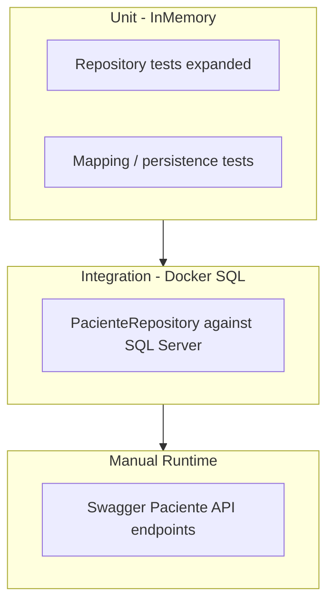

# Design - Paciente SQL Stabilization

> Input: `specify.md` in `Documentation/SDD/paciente-sql-stabilization/`
> Generated SDD artifacts are written in English.

## Design Summary

This feature stabilizes the existing Paciente SQL vertical without introducing new aggregates, schema migrations, or frontend changes. The work closes known gaps in field persistence, repository test coverage, API error handling, PHI-safe logging, patient search contract clarity, and SQL integration testing against Docker SQL Server.

The approved migration sequence governs scope: stabilize domain behavior and SQL persistence first, then API contracts, then validate through automated tests and Swagger. Frontend alignment is deferred to WS07 and is not a validation source for this feature.

Execute chooses implementation details (mapping strategy, exception handling patterns, test helpers) as long as outcomes meet the requirements in `specify.md`.

## Requirement Mapping

| Requirement | Design response |
|-------------|-----------------|
| `REQ-001` | Ensure create and update persist all DTO fields including Plano, Carteira, RG, and owned Endereco; verify with unit and integration tests |
| `REQ-002` | Confirm ADR-001 soft delete behavior excludes deleted patients from all default queries; expand test coverage |
| `REQ-003` | Apply single-resource vs collection search contract (see API Contract Decision); repository CPF exact, nome partial `Contains` |
| `REQ-004` | Align HTTP responses with documented status codes; eliminate unhandled persistence conflicts and missing-resource ambiguity |
| `REQ-005` | Remove PHI from controller logging; no patient-identifying fields in logs or error messages |
| `REQ-006` | Add SQL integration tests against Docker SQL Server with documented skip policy |
| `REQ-007` | Complete Swagger manual smoke for all active Paciente endpoints |
| `REQ-008` | Legacy table in `specify.md` reviewed and accepted; no code required for characterization |

## API Contract Decision

### Problem

The current `GET /Paciente/nome/{nome}` route uses single-result semantics (404 / 200 / 409) while the repository returns a list and nome search is intentionally partial match (`Contains`). Partial match routinely produces multiple results, making 409 the common case — a poor contract for search UX and API clarity.

### Decision

Separate **single-resource retrieval** from **collection search**. Execute must implement this contract; route naming may vary if equivalent behavior is preserved.

#### Single-resource retrieval

Returns exactly one `ReadPacienteDto` or an error. Never returns a list.

| Method | Route | Match rule | Success | Not found | Conflict / integrity |
|--------|-------|------------|---------|-----------|----------------------|
| GET | `/Paciente/{id}` | Exact `Guid` PK | 200 + `ReadPacienteDto` | 404 | — |
| GET | `/Paciente/cpf/{cpf}` | Exact CPF after trim | 200 + `ReadPacienteDto` | 404 | 409 if multiple rows (data integrity; should not occur with unique index) |

#### Collection search

Returns `IEnumerable<ReadPacienteDto>`. Empty result set is **200 with `[]`**, not 404.

| Method | Route | Match rule | Success | Validation error |
|--------|-------|------------|---------|------------------|
| GET | `/Paciente?skip=&take=` | Paginated list of active patients, ordered by `Nome` | 200 + array (may be empty) | 400 for invalid pagination |
| GET | `/Paciente/search?nome=&skip=&take=` | Partial nome (`Contains`, case per EF/SQL default) | 200 + array (may be empty) | 400 if `nome` missing or whitespace |

**Alternative acceptable to Execute:** extend `GET /Paciente` with optional `nome` query parameter instead of a separate `/search` route, provided collection semantics (200 + array) are preserved.

#### Retired contract

- `GET /Paciente/nome/{nome}` single-result semantics (404 / 200 / 409) are **retired**. Execute must remove or repurpose this route to collection search. WS07 frontend work will consume the collection search contract.

#### Mutations (unchanged intent)

| Method | Route | Request | Response | Notes |
|--------|-------|---------|----------|-------|
| POST | `/Paciente` | `CreatePacienteDto` | 201 + `ReadPacienteDto` | Duplicate CPF → 409 |
| PUT | `/Paciente/{id}` | `UpdatePacienteDto` | 204 | Missing resource → 404 |
| DELETE | `/Paciente/{id}` | — | 204 | Soft delete; missing → 404 |

Commented PDF report routes remain out of scope.

## Affected Components

| Component | Area | Responsibility | Expected change |
|-----------|------|----------------|-----------------|
| Paciente aggregate | Domain | Cadastral identity, soft delete, owned Endereco | Verify or adjust field persistence on create/update |
| Paciente repository | Infrastructure | SQL CRUD, search queries | Verify query semantics match contract |
| Paciente API | Controllers | HTTP mapping, status codes, PHI-safe handling | Update to match API contract decision |
| DTO mapping | Application | Create/update/read DTO mapping | Ensure all fields round-trip |
| EF configuration | Infrastructure | Mappings, soft-delete filter, CPF uniqueness | Verify only unless gap found |
| Repository unit tests | Tests | InMemory coverage | Expand for fields, soft delete, search |
| SQL integration tests | Tests | Docker SQL CRUD | Add with skip policy |
| Legacy reference | Legacy folder | Behavioral evidence | Read-only; no changes |

## Reuse Analysis

| Existing code or pattern | Reuse decision | Notes |
|--------------------------|----------------|-------|
| `PacienteRepository` CRUD implementation | Reuse | Reference for future aggregates |
| `PacienteRepositoryTests` InMemory pattern | Reuse | Extend with additional cases |
| `PacienteConfig` + `InitialCreate` migration | Reuse | No schema change expected |
| ADR-001 soft delete + global filter | Reuse | Authoritative |
| Current create mapping (partial field coverage) | Do not reuse as-is | Must meet REQ-001 full field persistence |
| `Console.WriteLine` in controller | Do not reuse | PHI violation |
| Legacy `PacienteSheetsRepository` | Reference only | Not implementation authority |
| Ambiguous nome single-result route | Do not reuse | Replaced by collection search contract |

## Architecture And Ownership

- Architecture impact: None durable — stabilizes existing Paciente vertical within clinical bounded context
- Ownership boundaries: Paciente aggregate root owns cadastral identity; repository in Infrastructure; API in Controllers; DTOs in Application
- Conflicts or constraints: ADR-001 overrides any legacy physical-delete behavior; WS07 owns future frontend alignment

## Data And Persistence

- Entities: `Paciente`, `Endereco` (owned)
- DTOs: `CreatePacienteDto`, `UpdatePacienteDto`, `ReadPacienteDto`, address DTOs
- EF mappings: unique CPF index, owned `Endereco_*` columns, required Nome/CPF/Email/Telefone per current config
- Migration impact: **None expected** — stabilization only; schema from `InitialCreate` is stable
- SQL/runtime checks: Docker `docorgano-sql`, migrated database, connection via `DefaultConnection` or `DOCORGANO_TEST_CONNECTION` for tests

## Frontend Impact

No UI impact is planned or validated by this feature. Frontend alignment will occur after backend stabilization through WS07.

API contract decisions are validated via Swagger and automated tests only — not via Blazor consumption.

- Pages/components: None
- Services/state: None
- UI behavior: None
- Smoke checks: None

## Security And PHI Design

- Security-sensitive: **Yes**
- Review prompt expected: **Yes** — `Documentation/AI-Harness/review-prompts/security-phi-review.md`
- Mitigations:
  - Remove patient-identifying data from controller logs and error responses
  - Use synthetic test data only in fixtures
  - Do not log request bodies or patient fields in error handlers
  - `AtualizadoPor` remains unset until auth ADR — accepted residual risk

## Legacy Behavior Decision

| Behavior | Source | Preserve / Adapt / Abandon | Design rationale |
|----------|--------|----------------------------|------------------|
| CRUD surface | `PacienteSheetsRepository.cs` | Preserve | Repository contract retained |
| Soft delete | SQL + ADR-001 | Preserve | Clinical history preservation |
| CPF uniqueness | SQL unique index | Preserve | Stronger than legacy |
| Nome search exact | Legacy filter | Adapt | Partial `Contains`; API uses collection search |
| List ordering | Legacy sheet order | Adapt | SQL `OrderBy(Nome)` |
| PDF reports | Legacy (commented) | Abandon | Out of scope |
| `"0"` null sentinels | Legacy sheet writes | Abandon | SQL nullable columns |
| Physical delete | Legacy `DeleteLineAsync` | Abandon | ADR-001 |
| Nome single-result API route | Current controller | Abandon | Replaced by collection search contract |

## Testing Approach

Approved sequence: unit tests → SQL integration tests → Swagger manual smoke (Runtime Validation Environment in `specify.md`).

| Requirement | Test or check approach | Notes |
|-------------|------------------------|-------|
| `REQ-001` | Unit test full field create/update; SQL integration create/read/update | Endereco owned columns included |
| `REQ-002` | Unit test delete then query exclusion | Global filter behavior |
| `REQ-003` | Unit tests: CPF single-resource; nome collection search | Assert array semantics for nome |
| `REQ-004` | Automated status-code tests where practical; Swagger smoke | See Runtime Validation Environment |
| `REQ-005` | Code review + security-phi-review sensor | |
| `REQ-006` | SQL integration test class against Docker SQL | See SQL Integration Testing in `tasks.md` |
| `REQ-007` | Manual Swagger checklist | DocAPI running only |
| `REQ-008` | Review legacy table in specify.md | Pre-execute sign-off |

## Verification Handoff Notes

- Expected gates: Build, automated tests, SQL/persistence, API (Swagger), security/PHI, domain review, legacy characterization, documentation review
- Expected review sensors: domain-review, security-phi-review, test-strategy, check-docs
- Known skipped or manual checks: SQL integration tests may skip per documented policy; Swagger is manual during Execute; formal `verification.md` is Verify-phase work; UI gate not expected (WS07 deferred)
- Evidence Execute must produce for Verify:
  - `dotnet build` and `dotnet test` output
  - SQL integration test results or skip reason per policy
  - Swagger smoke checklist in session notes
  - Legacy behavior table acceptance
  - Residual risks: `AtualizadoPor`, CPF checksum, frontend alignment deferred to WS07

## Risks

| Risk | Impact | Mitigation |
|------|--------|------------|
| Create/update does not persist all DTO fields | High — silent data loss | REQ-001 tests; mapping fix before integration tests |
| Docker SQL unavailable in CI/agent environment | Medium — integration tests blocked | Documented skip policy; local Docker required for full verify |
| Nome route change affects undocumented consumers | Low | No frontend in scope; WS07 will adopt collection contract |
| Duplicate CPF causes unhandled 500 | Medium | REQ-004; map persistence conflict to 409 |
| CPF checksum not validated | Low | Accepted for MVP2; open question |
| `AtualizadoPor` never populated | Low | Accepted residual risk until auth ADR |

## ADR Evaluation

| Question | Answer |
|----------|--------|
| Does this change affect durable architecture, persistence, schema lifecycle, security/auth, API contracts, ownership, runtime, or irreversible migration decisions? | No — nome route contract clarification is feature-level stabilization, not a new public API standard ADR |
| Existing ADRs referenced | ADR-001 (soft delete) |
| New ADR candidate | None |
| Decision needed before tasks or execution? | No — API contract decision is recorded in this document |

## Documentation Follow-up Candidates

- State: Mark Paciente backend slice stabilized; update runtime status and next steps
- ADR: None expected
- Architecture docs: None unless domain validation rules are added later
- Technical docs: Check off Paciente items in `migration-sql.md`; optional Paciente section in API contract doc
- Rules: Only if new PHI logging patterns emerge
- Skills: `sql-migration-workflow` if integration test pattern becomes standard
- Review prompts: None unless security findings require prompt updates
- Templates: SDD pilot lessons from this feature
